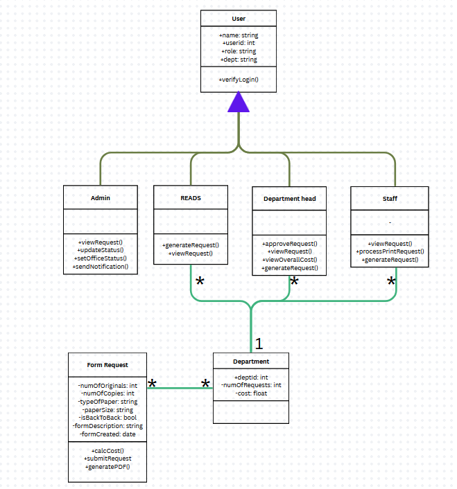

# PrintingSectionSystems
Digital Printing Request

When a REEDs wants to have test papers to be printed, they have to manually go to the printing station to and send a request form for approval in the site before the requests is catered to with this system they can ask for approval and submit the appropreate documents, bond paper size, number of copies etc, so that they only need to go to the printing station for submission of original copies and picking it up

