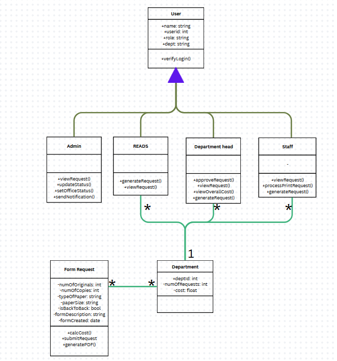

# PrintingSectionSystems
Digital Printing Request

When a READs wants to have test papers to be printed, they have to manually go to the printing station to and send a request form for approval in the site before the requests is catered to with this system they can ask for approval and submit the appropreate documents, bond paper size, number of copies etc, so that they only need to go to the printing station for submission of original copies and picking it up.

The system not only simplifies the printing request process but also enhances time management for both READS members and staff. By eliminating the need for frequent physical coordination, users and printing personnel can dedicate more time to other essential academic or administrative responsibilities while awaiting approval or completion. Moreover, the system acts as a centralized database for all printing transactions, allowing easy access to past requests, tracking of printing volumes, and promoting accountability in paper usage and approval procedures. By reducing unnecessary printing and travel, it also encourages sustainability, as digital submissions and approvals help minimize paper waste and conserve resources.

  
